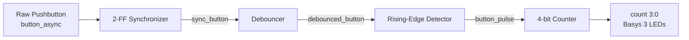

# Basys 3 Button Counter with Synchronizer, Debouncer, and Edge Detector

A SystemVerilog FPGA project for the **Digilent Basys 3** that converts a noisy asynchronous pushbutton input into a clean, single-clock-cycle event and uses that event to increment a 4-bit counter.

This project was completed as **Day 6** of an FPGA engineering study sequence focused on sequential logic, clock-domain safety, input conditioning, synthesis, and hardware verification in **AMD/Xilinx Vivado**.

## Project Objective

A physical pushbutton creates three separate design problems:

- It is **asynchronous** to the 100 MHz FPGA clock.
- Its mechanical contacts can **bounce**, producing multiple transitions from one press.
- It can remain HIGH for many clock cycles while being held.

This design solves those problems in stages:

1. **2-FF Synchronizer** — reduces the probability that metastability propagates into downstream logic.
2. **Debouncer** — accepts a new button state only after it remains stable for a programmable number of clock cycles.
3. **Rising-Edge Detector** — converts the clean button transition into one clock-cycle pulse.
4. **4-bit Counter** — increments once for each valid button press.

## Architecture



All sequential blocks use the same **100 MHz system clock**.

| Signal | Meaning |
|---|---|
| `button_async` | Raw physical pushbutton input |
| `sync_button` | Button signal synchronized to the FPGA clock domain |
| `debounced_button` | Clean, stable button level |
| `button_pulse` | One-clock-cycle pulse on a valid rising edge |
| `count[3:0]` | 4-bit counter output displayed on LEDs |

## Repository Structure

```text
rtl/
├── sync_2ff.sv
├── debounce.sv
├── edge_detect.sv
├── counter4.sv
└── button_counter_top.sv

sim/
└── button_counter_top_tb.sv

constraints/
└── button_counter_basys3.xdc
```

## 2-FF Synchronizer

The first flip-flop directly samples the asynchronous input and is therefore the stage most exposed to metastability. The second flip-flop samples the first stage one clock later, greatly reducing the probability that metastability propagates into the rest of the design.

```systemverilog
logic sync_ff1;

always_ff @(posedge clk) begin
    sync_ff1 <= async_in;
    sync_out <= sync_ff1;
end
```

Conceptually:

```text
async input
    |
    v
  FF1        <- metastability-exposed stage
    |
    v
  FF2        <- synchronized output
    |
    v
sync_out
```

The synchronizer does **not eliminate metastability**; it reduces the probability that it reaches downstream logic.

## Debouncer

Synchronization does not remove mechanical contact bounce. A real switch may briefly produce:

```text
0 -> 1 -> 0 -> 1 -> 0 -> 1
```

The debouncer compares the synchronized input with the currently accepted output state.

```systemverilog
if (sync_in == debounced_out) begin
    count <= '0;
end
else begin
    if (count == STABLE_CYCLES - 1) begin
        debounced_out <= sync_in;
        count         <= '0;
    end
    else begin
        count <= count + 1'b1;
    end
end
```

The hardware configuration uses:

```systemverilog
parameter integer STABLE_CYCLES = 1_000_000;
```

At 100 MHz:

```text
Tclk = 10 ns
1,000,000 cycles x 10 ns = 10 ms
```

So the hardware debounce interval is approximately **10 ms**.

The counter width is derived automatically:

```systemverilog
localparam integer COUNT_WIDTH = $clog2(STABLE_CYCLES + 1);
```

For one million stable cycles, the debounce counter is **20 bits** wide.

## Rising-Edge Detector

The debounced button may remain HIGH for a long time. If it were connected directly to `counter4.en`, the counter would increment on every rising clock edge while the button remained pressed.

The edge detector stores the previous sampled value:

```systemverilog
logic prev;

always_ff @(posedge clk) begin
    if (rst)
        prev <= 1'b0;
    else
        prev <= debounced_in;
end

assign pulse = debounced_in & ~prev;
```

The rising-edge condition is:

```text
previous = 0
current  = 1
```

so:

```text
pulse = current AND NOT(previous)
```

At 100 MHz, the resulting pulse lasts approximately **one 10 ns clock period**.

```text
debounced_button:  0 0 1 1 1 1 1 ...
button_pulse:      0 0 1 0 0 0 0 ...
```

## 4-bit Counter

The one-cycle pulse drives the counter enable:

```systemverilog
always_ff @(posedge clk) begin
    if (rst)
        count <= 4'b0000;
    else if (en)
        count <= count + 1'b1;
end
```

The 4-bit counter naturally wraps modulo 16:

```text
0000 -> 0001 -> ... -> 1111 -> 0000
```

## Top-Level Integration

```systemverilog
module button_counter_top #(
    parameter integer STABLE_CYCLES = 1_000_000
)(
    input  logic       clk,
    input  logic       rst,
    input  logic       button_async,
    output logic [3:0] count
);

    logic sync_button;
    logic debounced_button;
    logic button_pulse;

    sync_2ff SYNC (
        .clk      (clk),
        .async_in (button_async),
        .sync_out (sync_button)
    );

    debounce #(
        .STABLE_CYCLES(STABLE_CYCLES)
    ) DEBOUNCE (
        .clk           (clk),
        .rst           (rst),
        .sync_in       (sync_button),
        .debounced_out (debounced_button)
    );

    edge_detect EDGE (
        .clk          (clk),
        .rst          (rst),
        .debounced_in (debounced_button),
        .pulse        (button_pulse)
    );

    counter4 COUNTER (
        .clk   (clk),
        .rst   (rst),
        .en    (button_pulse),
        .count (count)
    );

endmodule
```

## Behavioral Simulation

For simulation, the debounce threshold was reduced to keep the run time short:

```systemverilog
button_counter_top #(
    .STABLE_CYCLES(5)
) DUT (
    .clk          (clk),
    .rst          (rst),
    .button_async (button_async),
    .count        (count)
);
```

The testbench intentionally applied raw button transitions at non-clock-aligned times and included simulated bounce.

Important waveform signals:

```text
button_async
sync_button
debounced_button
button_pulse
count
```

Verified signal flow:

```text
raw button bounce
        |
        v
synchronized button
        |
        v
stable debounced transition
        |
        v
one 10 ns pulse
        |
        v
count increments once
```

## Synthesis Observations

Vivado synthesis confirmed the expected hardware structures.

### Synchronizer

The 2-FF synchronizer synthesized to two `FDRE` registers:

```text
sync_ff1_reg
sync_out_reg
```

### Debouncer

The debouncer synthesized into:

- `count_reg[19:0]` — 20 flip-flops storing the stability count
- `debounced_out_reg` — flip-flop storing the accepted button state
- LUT logic — comparison and control logic
- `CARRY4` resources — arithmetic carry-chain hardware for the counter increment

```text
FDRE
-> sequential logic
-> stores state

LUT / CARRY4
-> combinational logic
-> computes next values
```

### Edge Detector

The previous-state memory synthesized to:

```text
prev_reg
```

The combinational pulse expression can be optimized or absorbed into downstream logic, but `prev_reg` must remain because the circuit needs memory of the previous sample.

## Basys 3 Constraints

| FPGA Port | Basys 3 Resource | Package Pin |
|---|---|---|
| `clk` | 100 MHz oscillator | `W5` |
| `rst` | Center pushbutton | `U18` |
| `button_async` | Right pushbutton | `T17` |
| `count[0]` | LD0 | `U16` |
| `count[1]` | LD1 | `E19` |
| `count[2]` | LD2 | `U19` |
| `count[3]` | LD3 | `V19` |

Clock timing constraint:

```tcl
create_clock -add -name sys_clk_pin -period 10.000 -waveform {0 5} [get_ports clk]
```

The physical oscillator generates the clock; `create_clock` tells Vivado to analyze timing assuming a 10 ns clock period.

## Hardware Verification

The design was implemented, a bitstream was generated, and the Basys 3 was programmed successfully.

| Test | Result |
|---|---|
| Press right button once | Counter increments once |
| Hold right button for several seconds | Counter increments only once |
| Release right button | Counter does not increment |
| Press center reset button | `count[3:0]` returns to `0000` |
| Repeated valid presses | LEDs count in binary |

## Key Engineering Lessons

- External pushbuttons are asynchronous to the FPGA clock.
- A 2-FF synchronizer reduces metastability propagation risk.
- Synchronization and debouncing solve different problems.
- A debouncer validates a candidate state over a defined number of clock cycles.
- A rising-edge detector compares the current input with a stored previous sample.
- `current & ~previous` detects a rising edge.
- A one-cycle event pulse prevents a prolonged button hold from causing repeated counter increments.
- `FDRE` registers store state across clock cycles.
- LUTs and `CARRY4` resources perform combinational computation.
- Synthesis may absorb combinational signals while preserving required sequential state.

## Tools and Hardware

- **HDL:** SystemVerilog
- **Toolchain:** AMD/Xilinx Vivado
- **Board:** Digilent Basys 3
- **FPGA:** Xilinx Artix-7
- **Clock:** 100 MHz

## Project Status

**Complete and verified on hardware.**

The final design successfully converts a noisy asynchronous mechanical pushbutton into one clean counter event per press using synchronization, debouncing, and rising-edge detection.


## Hardware Demonstration

The design was programmed onto a Digilent Basys 3 and verified on hardware.

Verified behavior:

- One button press produces one counter increment.
- Holding the button does not cause repeated increments.
- Releasing the button does not increment the counter.
- The reset button returns `count[3:0]` to `0000`.

[Watch the hardware verification video](hardware_verification.mp4)
